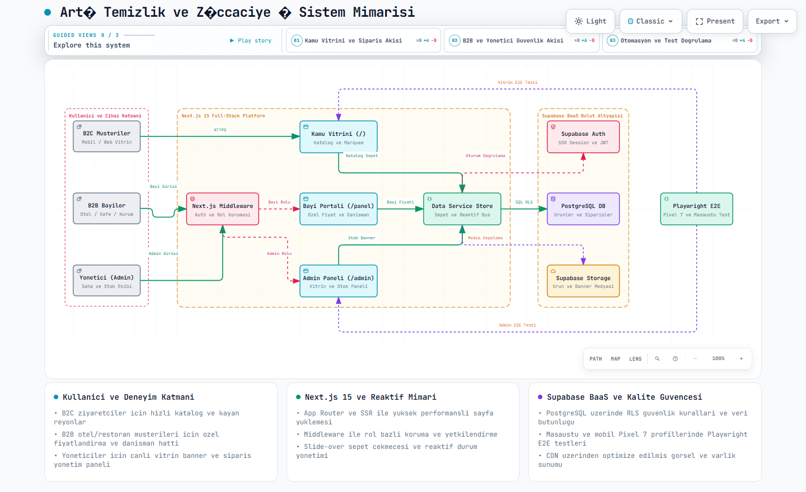

# Artı Temizlik & Züccaciye — Toptan & Perakende Sipariş Platformu

Modern, hızlı ve mobil öncelikli B2B & B2C toptan/perakende sipariş ve e-ticaret yönetim platformu. 

Akdeniz bölgesinde (Anamur, Bozyazı, Aydıncık) otel, restoran, kafe, eğitim kurumları ve yerel işletmelere yönelik endüstriyel temizlik, kağıt grubu, ambalaj ve züccaciye ürünlerinin hızlı tedariği için geliştirilmiştir.

---

## 📐 Sistem & Uygulama Mimarisi

Aşağıdaki mimari diyagramı; platformun B2C kamu vitrini, B2B bayi portalı, yönetim paneli, Next.js 15 App Router çekirdeği, Supabase BaaS ve Playwright E2E test katmanları arasındaki veri ve yetki akışını göstermektedir:

<p align="center">
  
</p>

> 💡 **İnteraktif Mimari Görünümü:** Archify ile üretilen bağımsız ve etkileşimli HTML haritasını [`public/architecture.html`](public/architecture.html) dosyası üzerinden tarayıcınızda açıp inceleyebilirsiniz.

---

## 🌟 Öne Çıkan Özellikler

### 🏪 1. Kamu Vitrini & Katalog Deneyimi
- **Kayan Kategori Reyonları (Infinite Marquee):** Çok satanlar ve haftanın fırsatları için akıcı ve dinamik kayar vitrin akışı.
- **Akıllı Arama & Filtreleme:** Kategori bazlı anlık filtreleme, arama ve stok durumu gösterimi.
- **Kampanyalara Özel Ürün Atama:** Admin tarafından seçilen ürünlerin listelendiği dinamik kampanya sayfaları (`/kampanya/[id]`).
- **Toptan & Perakende Fiyatlandırma:** Misafir kullanıcılar için fiyat gizleme / kilit mekanizması ve kurumsal bayilere özel net koli fiyatları.

### 🛒 2. Akıllı Sepet & Sipariş Akışı
- **Hızlı Sepet Çekmecesi (Slide-Over Drawer):** Sayfadan ayrılmadan adet artırma/azaltma, sepet toplamı ve minimum sipariş tutarı kontrolü.
- **Sipariş Oluşturma:** Teslimat bilgileri, işletme türü ve sipariş notları ile tek tıkla sipariş iletimi.

### 👥 3. B2B Müşteri / Bayi Portalı (`/panel`)
- **Kurumsal Giriş:** Otel, restoran ve kurumsal müşterilere özel giriş ve oturum yönetimi.
- **Kişiselleştirilmiş Saha Danışmanı:** Her müşteriye veya bölgeye atanmış saha danışmanının adı, telefonu ve WhatsApp hızlı erişim kartı.
- **Sipariş Geçmişi:** Geçmiş siparişlerin durum takibi (Onay Bekliyor, Hazırlanıyor, Teslim Edildi).

### 🛠️ 4. Kapsamlı Yönetici (Admin) Paneli (`/admin`)
- **Ürün Yönetimi:** Ürün ekleme/düzenleme, stok durumu (Aktif / Tükendi) kontrolü, tek tıkla yayından kaldırma/yayınlama ve kategori yönetimi.
- **Vitrin & Kampanya Yönetimi:** Ana sayfa hero banner kartlarının metin, rozet, buton ve atanacak ürünlerinin canlı modal üzerinden seçilmesi.
- **Saha Danışmanları & İletişim:** Saha satış temsilcilerinin iletişim bilgileri ve durumlarının yönetimi.
- **Sipariş Takibi:** Gelen siparişlerin detaylı dökümü ve durum güncellemesi.

### 📱 5. Mobil & Dokunmatik Optimizasyon
- Tüm cihazlar (320px–428px akıllı telefonlar, tabletler ve masaüstü) için %100 responsive tasarım.
- Safe-area (iOS çentik) desteği, yapışık alt sipariş çubukları (sticky bar) ve touch-scroll optimizasyonları.

### 🧪 6. Playwright ile Uçtan Uca (E2E) Test Altyapısı
- Masaüstü (Chromium) ve Mobil (Pixel 7) profillerinde otomatik edge-case testleri.
- Sepet akışı, yetkisiz panel erişimi koruması ve vitrin kampanya modal kontrolleri.

---

## 🚀 Teknolojik Yığın (Tech Stack)

- **Framework:** [Next.js 15](https://nextjs.org/) (App Router, Server Components & Client Components)
- **Kütüphane:** [React 19](https://react.dev/)
- **Dil:** [TypeScript](https://www.typescriptlang.org/)
- **Stil & Tasarım:** [Tailwind CSS](https://tailwindcss.com/) & Vanilla CSS Tokens
- **İkon Seti:** [Lucide React](https://lucide.dev/)
- **Test:** [Playwright Test](https://playwright.dev/) (End-to-End & Mobile Emulation)
- **Veritabanı / Backend Desteği:** [Supabase](https://supabase.com/) (SSR & Client entegrasyonu hazır)

---

## 📂 Proje Dizin Yapısı

```
artı-temizlik-züccaciye/
├── app/
│   ├── (auth)/             # Giriş ve kimlik doğrulama sayfaları
│   ├── (public)/           # Kamu vitrini, ürün detay ve kampanya sayfaları
│   ├── admin/              # Yönetici paneli sayfaları (ürünler, vitrin, siparişler)
│   ├── panel/              # B2B Müşteri / Bayi portalı
│   └── globals.css         # Global stiller, animasyonlar ve safe-area tanımları
├── components/
│   ├── admin/              # Admin bileşenleri ve sidebar drawer
│   ├── catalog/            # Ürün kartları, kayan reyonlar ve vitrin bannerları
│   ├── layout/             # Header, Footer ve kategori gezinti çubukları
│   └── ui/                 # Modal, Drawer, Button ve Input bileşenleri
├── lib/
│   ├── dataService.ts      # Veri yönetimi ve reaktif event bus
│   ├── mockData.ts         # Başlangıç ürün, kategori ve kampanya verileri
│   ├── store/              # Kimlik doğrulama ve sepet store'ları
│   └── types/              # TypeScript tip tanımlamaları
├── tests/                  # Playwright E2E test senaryoları
├── playwright.config.ts    # Playwright konfigürasyonu
└── README.md
```

---

## 💻 Kurulum ve Çalıştırma

### Gereksinimler
- Node.js 18+ veya daha yeni bir sürüm
- npm, yarn veya pnpm

### 1. Projeyi Klonlayın
```bash
git clone https://github.com/emrahsahn/arti-temizlik-zuccaciye.git
cd arti-temizlik-zuccaciye
```

### 2. Bağımlılıkları Yükleyin
```bash
npm install
```

### 3. Geliştirme Sunucusunu Başlatın
```bash
npm run dev
```
Tarayıcınızda [http://localhost:3000](http://localhost:3000) adresine giderek uygulamayı görüntüleyebilirsiniz.

---

## 🧪 Testleri Çalıştırma

Playwright ile uçtan uca testleri çalıştırmak için:

```bash
# Tüm E2E testlerini terminalde çalıştır
npm run test:e2e

# Playwright görsel arayüzü ile adım adım izle
npm run test:e2e:ui

# Otomatik test kodu üreticiyi başlat
npm run test:codegen
```

---

## 👨‍💻 Geliştirici

**Emrah Şahin**  
- LinkedIn: [linkedin.com/in/emrah-şahin](https://www.linkedin.com/in/emrah-şahin/)
- GitHub: [@emrahsahn](https://github.com/emrahsahn)

---

## 📄 Lisans

Bu proje özel mülkiyete tabidir. Tüm hakları saklıdır.
